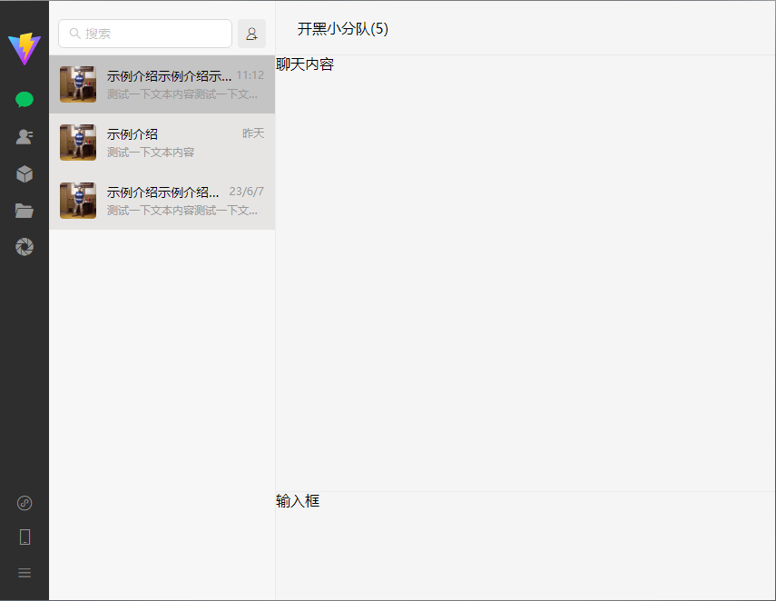

# Vue3 WeChat

- 使用 Vite + Vue3 + AntDesignVue + Pinia + MockJS 搭建的复刻新版微信项目
- 目前进度：**基础功能搭建完毕，精细化细节点**
- [查看演示](https://ele-cat.gitee.io/vue3-wechat/)

## 功能截图



## 使用

### 安装

```
npm install
```

### 运行

```
yarn serve
```

### 打包

```
yarn build
```

## 功能点

- [x] 界面主体
  - [x] 拖动
  - [x] 缩放
  - [x] 置顶
  - [x] 最小化
  - [x] 最大化
  - [x] 关闭
- [x] 工具栏
  - [x] 用户头像
  - [x] 聊天
  - [x] 通讯录
  - [x] 收藏
  - [x] ~~聊天文件~~
  - [x] 朋友圈
  - [x] 小程序
  - [x] 手机
  - [x] 设置及其他
    - [x] 锁定、解锁
    - [x] 意见反馈
    - [x] 设置
- [x] 列表栏
  - [x] 聊天
    - [ ] 搜索
    - [ ] 发起群聊
    - [ ] 最后一条消息发送/接收时间
    - [ ] 最后一条消息发送/接收内容
    - [ ] 预设[小爱同学 API](http://jiuli.xiaoapi.cn/i/chat/xiaoai_tts.php?msg=你好)
    - [ ] 普通用户
      - [ ] 置顶、取消置顶
      - [ ] 标为未读、标为已读
      - [ ] 消息免打扰、开启新消息提醒
      - [ ] 在独立窗口中打开
      - [x] 不显示聊天
      - [x] 删除聊天
    - [ ] 群聊
      - [ ] 置顶、取消置顶
      - [ ] 标为未读、标为已读
      - [ ] 消息免打扰、开启新消息提醒
      - [ ] 修改群聊名称
      - [ ] 设置备注
      - [ ] 在独立窗口中打开
      - [ ] 保存到通讯录
      - [ ] 不显示聊天
      - [ ] 删除聊天
    - [ ] ~~订阅号~~
  - [x] 通讯录
    - [ ] 搜索
    - [ ] 添加朋友
    - [ ] ~~通讯录管理~~
    - [ ] 新的朋友
    - [ ] ~~公众号~~
    - [ ] 群聊
      - [ ] 发消息
      - [ ] 设置备注
      - [ ] 从通讯录中删除
      - [ ] 退出群聊
    - [x] 朋友
      - [x] 发消息
      - [ ] 标为星标朋友、取消星标朋友
      - [ ] 发送名片
      - [ ] 删除朋友
  - [x] 收藏
    - [ ] 搜索
    - [ ] 新建笔记
    - [x] 分类
    - [x] 标签
    - [x] 空间占用
- [x] 功能区域
  - [x] 聊天
    - [x] 顶部标题
    - [ ] 展开更多信息
    - [x] 聊天记录
    - [ ] 朋友头像【查看更多信息】
    - [ ] 聊天内容【文本、图片、语音、视频】
    - [ ] 聊天时间
    - [ ] 加载之前的聊天记录【分页】
    - [ ] 表情
    - [ ] 发送文件
    - [ ] 截图
    - [ ] 聊天记录
    - [ ] 通过快捷键发送消息
    - [ ] ~~语音聊天~~
    - [ ] ~~视频聊天~~
  - [x] 通讯录
    - [ ] 新的朋友
    - [ ] ~~公众号~~
    - [ ] 群聊
    - [x] 朋友
  - [x] 收藏
    - [x] 列表
    - [ ] 详情

## 使用的插件

- [pinia](github.com/vuejs/pinia)
- [pinia-plugin-persist](github.com/Seb-L/pinia-plugin-persist)
- [mockjs](github.com/nuysoft/Mock)
- [axios](github.com/axios/axios)
- [js-pinyin](github.com/waterchestnut/pinyin)
- [VueUse英文文档](https://vueuse.org/)
- [VueUse中文文档](https://www.vueusejs.com)
- [perfect-scrollbar](https://github.com/mdbootstrap/perfect-scrollbar)


## 参考文档、博客

- [一文搞懂 pinia 状态管理（保姆级教程）](https://zhuanlan.zhihu.com/p/533233367)
- [Vue3 + Pinia 持久化存储](https://blog.csdn.net/weixin_36757282/article/details/127226319)
- [mockjs 官网示例](http://mockjs.com/examples.html)
- [mockjs——mockjs 定义、mockjs 安装、mockjs 使用、mockjs 方法、mockjs 语法、代码示例](https://blog.csdn.net/TKY666/article/details/126215513)
- [正确开启 Mockjs 的三种姿势：入门参考（一）](https://www.cnblogs.com/soyxiaobi/p/9846057.html)
- [Vue 模拟通讯录列表用 js-pinyin 获取汉字首字母，形成字母索引](https://blog.csdn.net/m0_67063430/article/details/128951993)
- [svg仿mac最小化效果](http://www.qiutianaimeili.com/html/page/2018/03/mlo8if7lag8.html)